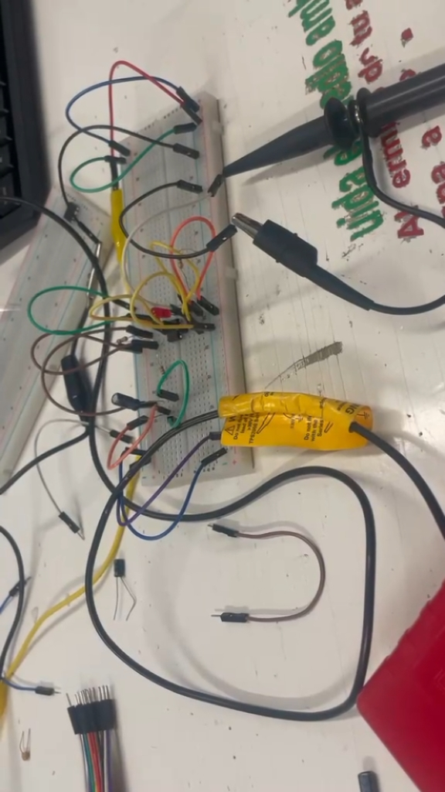
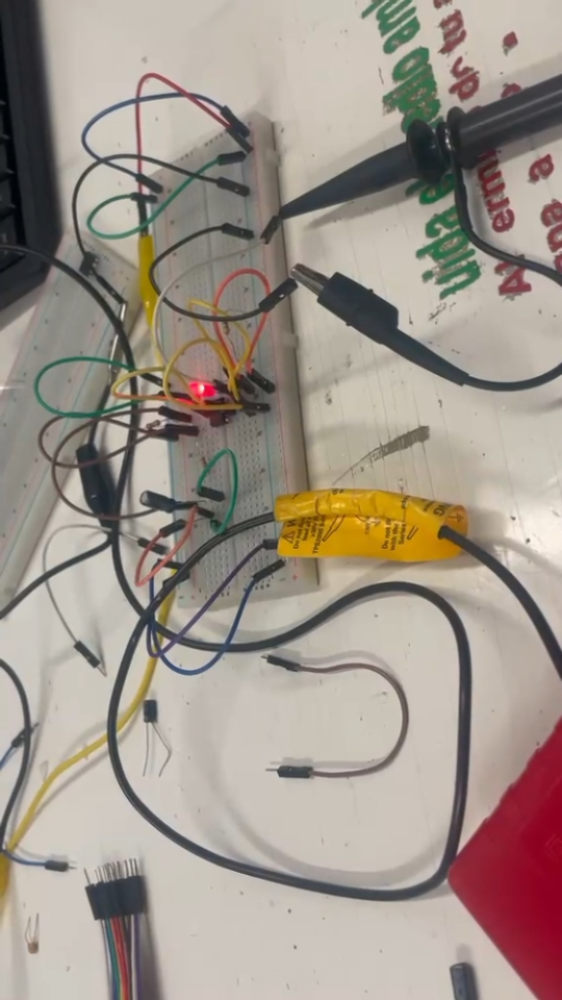
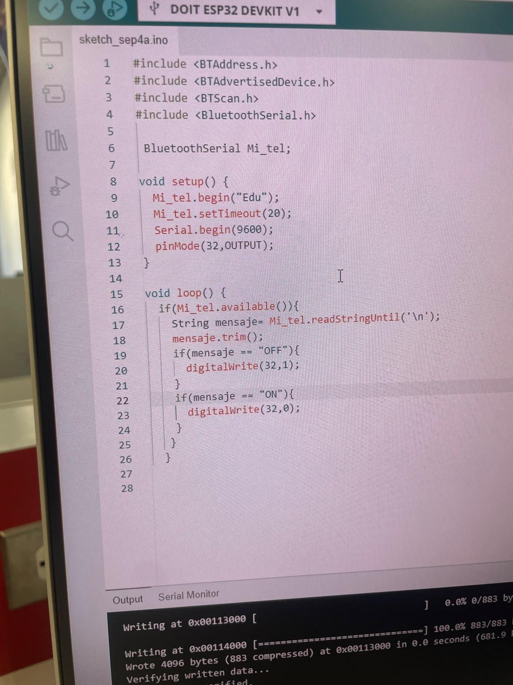
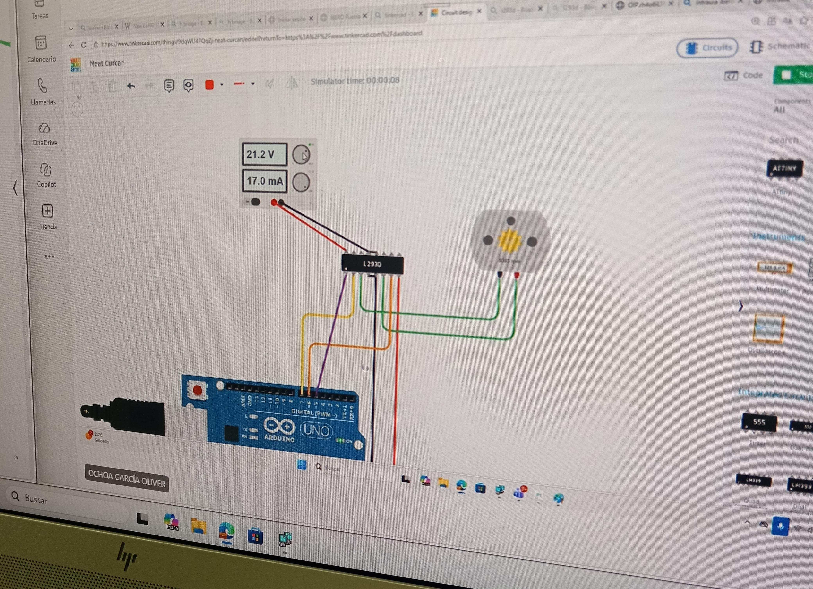

# Bitácora Universitaria: Ingeniería Mecatrónica

**Autora:** Carmen Leyva López  
**Asignatura:** Introducción a la Mecatrónica  
**Periodo:** Agosto – Septiembre 2026

---

## Resumen

> **¡Saludos! Soy Carmen.** 
> Decidí estudiar Ingeniería Mecatrónica por mi fascinación por los autómatas y los pequeños mecanismos que dan vida a objetos cotidianos, como los que encuentras dentro de una tostadora. 
> 
> Mi intención con esta bitácora es documentar los avances, retos y aprendizajes obtenidos a lo largo de la carrera.

  
   

---

## Índice

1. [Sesión 2: Intermitencia y Capacitores](#1-sesión-2-intermitencia-y-capacitores)
2. [Sesión 3: Conexión inalámbrica y microcontrolador ESP32](#2-sesión-3-conexión-inalámbrica-y-microcontrolador-esp32)
3. [Sesión 4: Motor DC y Servo](#3-sesión-4-motor-dc-y-servo)

---

## 1. Sesión 2: Intermitencia y Capacitores

| Campo | Detalle |
|:---|:---|
| **Fecha** | 28 de agosto del 2026 |
| **Autora** | Carmen Leyva López |
| **Asignatura** | Introducción a la mecatrónica |

### 1.1 Descripción

Durante esta sesión, ensamblamos el circuito basándonos en el esquema de conexión del LM3909. Evaluamos cómo la variación en voltaje afecta directamente el tiempo de parpadeo y, por consiguiente, la intensidad de luz del led.

### 1.2 Evidencia audiovisual

  <iframe width="315" height="576" src="https://www.youtube.com/embed/1JN5oAWgr-M" title="VID led_parpadeate" frameborder="0" allow="accelerometer; autoplay; clipboard-write; encrypted-media; gyroscope; picture-in-picture; web-share" referrerpolicy="strict-origin-when-cross-origin" allowfullscreen></iframe>
   
  <em>Video 1. Funcionamiento del circuito parpadeante.</em>

### 1.3 Evidencia fotográfica

  
  
   
  <em>Figura 1. Montaje en protoboard y LED parpadeando.</em>

---

## 2. Sesión 3: Conexión inalámbrica y microcontrolador ESP32

| Campo | Detalle |
|:---|:---|
| **Fecha** | 4 de septiembre del 2026 |
| **Autora** | Carmen Leyva López |
| **Asignatura** | Introducción a la mecatrónica |

### 2.1 Descripción

Usamos el microcontrolador ESP32, para programar la intermitencia unos leds y probar el monitor serial mediante un botón, al final lo logramos conectar via bluetooth a nuestro celular y mandar directamente la señal de encendido y apagado sin necesidad de ningún botón.

### 2.2 Evidencia audiovisual

  <iframe width="315" height="576" src="https://www.youtube.com/embed/1JN5oAWgr-M" title="VID led_parpadeate" frameborder="0" allow="accelerometer; autoplay; clipboard-write; encrypted-media; gyroscope; picture-in-picture; web-share" referrerpolicy="strict-origin-when-cross-origin" allowfullscreen></iframe>
   
  <em>Video 2. Demostración de conexión inalámbrica y control por Bluetooth.</em>

### 2.3 Evidencia fotográfica

  
  
   
  <em>Figura 2. Montaje en protoboard y LED parpadeando.</em>

---

## 3. Sesión 4: Motor DC y Servo

| Campo | Detalle |
|:---|:---|
| **Fecha** | 11 de septiembre del 2026 |
| **Autora** | Carmen Leyva López |
| **Asignatura** | Introducción a la mecatrónica |

### 3.1 Descripción

Los motores de DC son dispositivos que generan movimiento mecánico mediante la interacción de campos magnéticos. Durante la sesión vimos que estos dispositivos consumen una gran cantidad de corriente, por lo que para proporcionarles suficiente y controlarlos mediante un microcontrolador se necesitan un relé o transistores y un chip L2930, este último para invertir la rotación como queramos, utilizando el código.

### 3.2 Evidencia fotográfica

  
   
  <em>Figura 3. Montaje del motor DC en protoboard.</em>

---
